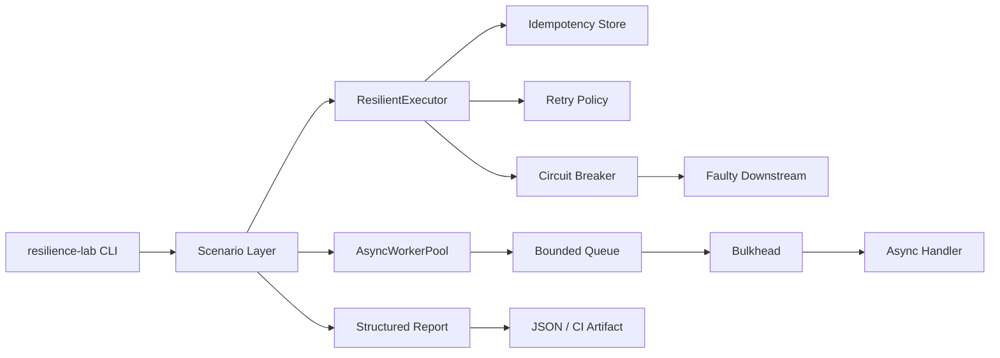

# Distributed Systems Resilience Lab

A small, executable reliability platform for studying how distributed-system failure patterns interact under load and partial failure.

This repository started as a collection of isolated interview snippets. It now has a package boundary, composable resilience primitives, deterministic failure scenarios, a CLI, concurrency tests, structured reports, and backward-compatible facades for the original modules.

The goal is **not** to pretend that an in-memory Python lab replaces Redis, Kafka, Envoy, Resilience4j, service meshes, or production coordination systems. The goal is to make the semantics of retries, circuit breakers, idempotency, DLQs, backpressure, and bulkheads easy to execute, inspect, test, and discuss.

## Architecture



### Package layout

```text
resilience/
├── executor.py              # idempotency + retry + circuit-breaker composition
├── worker_pool.py           # bounded ingress + bulkhead + worker lifecycle
├── reporting.py             # scenario events, counters and p95 latency
├── scenarios.py             # deterministic failure simulations
├── cli.py                   # resilience-lab command line interface
└── primitives/
    ├── retry.py
    ├── circuit_breaker.py
    ├── idempotency.py
    ├── dead_letter.py
    ├── backpressure.py
    └── bulkhead.py
```

The root-level `reliability.py`, `idempotency.py`, `dead_letter_queue.py`, `backpressure.py`, and `bulkhead.py` files remain as compatibility facades. New code should import from `resilience` or `resilience.primitives`.

## What the lab demonstrates

### Retry with exponential backoff and jitter

`RetryPolicy` models bounded retry attempts, exponential delay growth, optional maximum delay, and jitter. Time and randomness are injectable so tests do not need real sleeps or global random state.

Key idea: retries are useful for transient failures, but they also amplify load. They therefore need bounded attempts, backoff, jitter, and a clear retryable-exception policy.

### Circuit breaker state machine

`CircuitBreaker` has explicit `CLOSED`, `OPEN`, and `HALF_OPEN` states.

- repeated failures open the circuit;
- open circuits reject immediately;
- after the recovery timeout, one probe enters half-open behavior;
- a successful probe closes the circuit;
- a failed probe reopens it.

The clock is injectable, so recovery behavior is deterministic in tests.

### Idempotency with payload conflict detection

`IdempotencyStore` stores a request fingerprint and result per key. Concurrent duplicates for the same key serialize through a per-key lock, while unrelated keys do not share one global lock.

A replay with the same key and fingerprint returns the original result without executing the side effect again. Reusing the same key with a different payload raises an explicit `IdempotencyConflict`.

This mirrors the invariant expected from a production shared datastore even though this teaching implementation is process-local.

### Retry queue and dead-letter evidence

`RetryQueue` tracks message attempts and error history. Poison messages are retried up to a configured limit and then moved to a DLQ with the captured exception type and message preserved as evidence.

### Backpressure

`BackpressureQueue` is finite. Producers either enqueue within a timeout or receive a rejection. This makes overload visible instead of allowing unbounded memory growth.

### Bulkhead isolation

`Bulkhead` limits the number of concurrent calls entering a fragile downstream section and exposes active, peak, completed, and failed counters.

### Composed execution path

`ResilientExecutor` is where the patterns stop being isolated snippets:

```text
idempotency lookup
        ↓
retry budget
        ↓
circuit breaker
        ↓
downstream operation
```

A completed replay returns before consuming breaker capacity or retry budget. An open circuit fails fast rather than retrying an intentionally isolated dependency.

### Async worker path

`AsyncWorkerPool` composes:

```text
producer → bounded queue → worker(s) → bulkhead → async downstream handler
```

This demonstrates the distinction between **queue capacity** and **downstream concurrency**. Increasing worker count does not bypass the bulkhead.

## Scenarios

The CLI exposes deterministic scenarios that produce structured JSON reports.

```bash
pip install -e ".[dev]"

resilience-lab circuit-breaker --requests 20
resilience-lab retry-dlq --messages 12 --max-attempts 3
resilience-lab executor
resilience-lab worker-pool --items 20 --queue-size 3 --max-concurrency 2
resilience-lab suite --output report.json
```

Each report includes counters such as:

- successes;
- failures;
- rejected requests;
- retries;
- dead-lettered messages;
- duplicate/idempotent replays;
- event-level outcome details;
- p95 event latency.

The suite aggregates all scenarios into one summary.

## Tests

The test suite covers more than import or smoke checks. It validates:

- configured exception filtering for retries;
- deterministic backoff schedules;
- circuit open / half-open / recovery transitions;
- half-open failure reopening the circuit;
- idempotent replay and payload conflicts;
- concurrent duplicate requests executing a side effect exactly once;
- retry-to-DLQ transitions with preserved failure evidence;
- bounded queue rejection under pressure;
- bulkhead peak concurrency;
- composed retry + breaker + idempotency execution;
- async worker-pool lifecycle and drain behavior;
- CLI-generated structured reports.

Run locally with:

```bash
pytest -q
ruff check .
```

## Design trade-offs

This project intentionally uses standard-library/in-memory implementations so the failure semantics remain visible.

What would change in production:

| Lab primitive | Typical production equivalent |
| --- | --- |
| process-local idempotency store | PostgreSQL/Redis/DynamoDB with atomic conditional writes |
| in-memory retry queue | Kafka/SQS/RabbitMQ/Pub/Sub retry topics or queues |
| in-process circuit breaker | application library, sidecar, gateway, or service mesh policy |
| asyncio bounded queue | broker limits, admission control, bounded executors |
| semaphore bulkhead | bounded connection pools, worker pools, concurrency limiters |
| local metrics snapshot | Prometheus/OpenTelemetry metrics and traces |

Important distributed-system caveat: the local idempotency lock proves thread-level behavior only. Cross-process or cross-node correctness requires a shared transactional or conditional-write primitive.

## Interview topics this repo supports

This codebase is useful for discussing why:

- retries can cause retry storms;
- jitter reduces synchronized retry waves;
- circuit breakers and retries must be ordered carefully;
- an open circuit should usually fail fast;
- idempotency is stronger than simple duplicate detection;
- request fingerprints protect keys from accidental reuse;
- DLQs preserve evidence rather than silently dropping poison messages;
- backpressure controls queue growth;
- bulkheads isolate downstream concurrency;
- bounded queues and bounded concurrency solve different problems;
- exactly-once processing is generally an end-to-end invariant built from idempotency and atomic state transitions, not a magical broker setting.

## Why the compatibility modules still exist

The original repository exposed imports such as:

```python
from reliability import CircuitBreaker, retry
from idempotency import DedupStore
```

Those imports still work. The implementation has simply moved into the package so the repository can evolve without breaking earlier examples.
